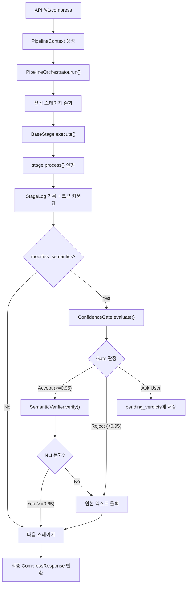
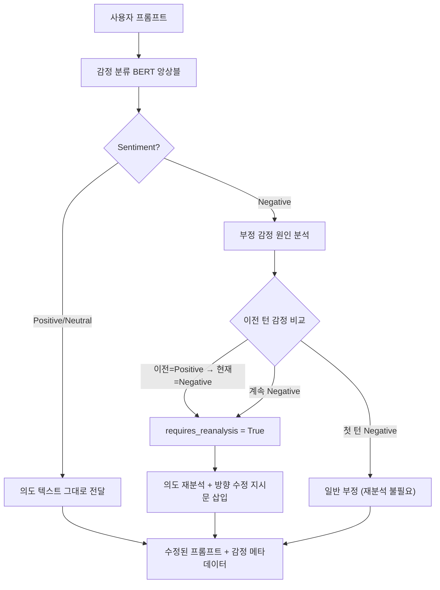

# Phase 1 - Core 모듈 완전 구현 계획

## 현재 상태 분석

현재 프로젝트는 구조(스캐폴드)가 잘 잡혀있지만, 다음 부분이 스켈레톤/TODO 상태:

- **NLI 의미 검증** (`nli_verifier.py`): `load()`, `verify()` 미구현 -- 항상 `True` 반환
- **Orchestrator 의미 검증 통합**: Confidence Gate만 있고, NLI 기반 의미 등가성 2차 검증이 연결 안 됨
- **토큰 카운팅**: API routes에서 `split()` 단어 카운팅 사용 -- tiktoken 미적용, 단일 모델만 지원
- **멀티모델 지원**: 모델 레지스트리 없음, 모델별 토크나이저/가격 정보 없음
- **metrics.py**: `compute_semantic_similarity()`, `compute_bertscore()` 미구현, ROUGE/BLEU/가독성 없음
- **EmotionLayer**: 기본 감정 리스트만 있고, sentiment 극성/재분석 플래그/멀티턴 감정 추적 없음
- **main.py startup**: ML 모델 프리로드 TODO
- **Stage 베이스 클래스**: 토큰 카운팅 로그 누락 (input_tokens/output_tokens)

---

## 데이터 흐름 아키텍처




---

## 핵심 파라미터 정의

### 지원 모델 레지스트리

6대 프로바이더, 주요 모델 전부를 지원한다. 각 모델은 고유 토크나이저와 가격 정보를 가진다.

- **OpenAI**: gpt-4o, gpt-4o-mini, gpt-4-turbo, gpt-3.5-turbo, o1, o3-mini -- tiktoken 사용
- **Anthropic Claude**: claude-3.5-sonnet, claude-3-haiku, claude-3-opus -- anthropic tokenizer 추정 (tiktoken cl100k_base 근사)
- **Google Gemini**: gemini-1.5-pro, gemini-1.5-flash, gemini-2.0-flash -- SentencePiece 기반 추정
- **Meta Llama**: llama-3.1-70b, llama-3.1-8b -- transformers AutoTokenizer
- **Mistral**: mistral-large, mistral-small, mixtral-8x7b -- SentencePiece (mistral tokenizer)
- **DeepSeek**: deepseek-v3, deepseek-coder -- tiktoken cl100k_base 호환

```python
@dataclass
class ModelInfo:
    provider: str           # "openai" | "anthropic" | "google" | "meta" | "mistral" | "deepseek"
    model_id: str           # "gpt-4o-mini"
    display_name: str       # "GPT-4o Mini"
    tokenizer_type: str     # "tiktoken" | "hf_auto" | "sentencepiece_approx"
    tokenizer_id: str       # tiktoken: "cl100k_base", HF: "meta-llama/..."
    input_price_per_1k: float   # USD per 1K input tokens
    output_price_per_1k: float  # USD per 1K output tokens
    context_window: int     # 최대 컨텍스트 크기
```

### PipelineContext 데이터 파라미터


| 필드                        | 타입                            | 설명                          | 기본값             |
| ------------------------- | ----------------------------- | --------------------------- | --------------- |
| `original_user_prompt`    | `str`                         | 원본 프롬프트 (불변)                | `""`            |
| `user_prompt`             | `str`                         | 현재 처리중 텍스트 (각 스테이지가 변환)     | `""`            |
| `domain`                  | `Domain`                      | 감지된 도메인                     | `UNKNOWN`       |
| `domain_confidence`       | `float`                       | 도메인 감지 신뢰도                  | `0.0`           |
| `emotion_layer`           | `EmotionLayer`                | 감정 분리 레이어 (확장, 아래 참조)       | 빈 객체            |
| `compression_level`       | `CompressionLevel`            | minimal/balanced/aggressive | `BALANCED`      |
| `target_model`            | `str`                         | 기본 타겟 모델                    | `"gpt-4o-mini"` |
| `compare_models`          | `list[str]`                   | 비교 대상 모델 목록 (빈 경우 전체 모델)    | `[]`            |
| `original_input_tokens`   | `int`                         | 원본 토큰 수 (target_model 기준)   | `0`             |
| `compressed_input_tokens` | `int`                         | 압축 후 토큰 수 (target_model 기준) | `0`             |
| `multi_model_tokens`      | `dict[str, ModelTokenResult]` | 모델별 토큰/비용 비교 결과             | `{}`            |


### EmotionLayer 확장 데이터 구조

기존 `EmotionLayer`를 감정 극성(sentiment) 분류 + 부정 감정 기반 의도 재분석 체계로 확장한다.

Phase 1에서는 데이터 구조와 파이프라인 인터페이스를 설계하고, Phase 2에서 실제 BERT 모델(beomi/KcBERT-base + klue/bert-base 앙상블)을 연결한다.

```python
class Sentiment(str, Enum):
    POSITIVE = "positive"
    NEGATIVE = "negative"
    NEUTRAL = "neutral"

@dataclass
class EmotionLayer:
    # 기존 필드
    emotions: list[str]          # ["frustrated", "confused"]
    confidence: float            # 감정 분류 신뢰도 (0.0~1.0)
    expressions: list[str]       # ["하 진짜", "ㅠ"]

    # Phase 1 확장 필드
    sentiment: Sentiment         # 감정 극성: positive/negative/neutral
    sentiment_score: float       # 극성 점수 (-1.0 ~ +1.0, 음수=부정)
    intent_text: str             # 감정 제거 후 순수 의도 텍스트
    requires_reanalysis: bool    # 부정 감정 감지 → 의도 재분석 필요 플래그
    reanalysis_reason: str       # 재분석 사유 ("사용자가 이전 답변에 불만족", "방향 수정 요청 감지" 등)
    emotion_history: list[dict]  # 멀티턴 감정 변화 추적 [{turn: 1, sentiment: "neutral"}, {turn: 2, sentiment: "negative"}]
```

**감정 기반 의도 재분석 흐름** (Phase 2에서 실제 동작):




**예시:**

- 턴1: "파이썬으로 웹스크래핑 알려줘" → sentiment=neutral, requires_reanalysis=false
- 턴2: "아 이거 안 되잖아 ㅠ 다른 방법 없어?" → sentiment=negative, requires_reanalysis=true, reanalysis_reason="이전 답변 방식이 동작하지 않음 - 대안 제시 필요"
- 결과: 프롬프트에 "이전에 제시한 방법이 효과적이지 않았으므로, 다른 접근 방식으로 설명해주세요" 맥락 삽입

**BERT 모델 (Phase 2 구현 예정):**

- `beomi/KcBERT-base`: 한국어 인터넷 말뭉치 학습 -- 감탄사/이모티콘/구어체에 강함
- `klue/bert-base`: 한국어 NLU 벤치마크 표준 모델 -- 정제된 텍스트에 강함
- 두 모델의 softmax 확률을 가중 평균하는 앙상블 전략
- 추후 `bert-base-multilingual-cased`로 다국어 확장

### ConfidenceGate 파라미터


| 파라미터             | 타입         | 설명               | 기본값    |
| ---------------- | ---------- | ---------------- | ------ |
| `mode`           | `GateMode` | auto/semi/manual | `AUTO` |
| `auto_threshold` | `float`    | AUTO 모드 수락 임계값   | `0.95` |
| `semi_lower`     | `float`    | SEMI 모드 거부 하한    | `0.70` |
| `semi_upper`     | `float`    | SEMI 모드 수락 상한    | `0.95` |


### NLI 검증 파라미터


| 파라미터             | 타입      | 설명                         | 기본값                                   |
| ---------------- | ------- | -------------------------- | ------------------------------------- |
| `model_name`     | `str`   | NLI 크로스인코더 모델              | `"cross-encoder/nli-deberta-v3-base"` |
| `threshold`      | `float` | 양방향 함의 수락 임계값              | `0.85`                                |
| `forward_score`  | `float` | original->compressed 함의 점수 | -                                     |
| `backward_score` | `float` | compressed->original 함의 점수 | -                                     |


### StageResult 파라미터


| 파라미터         | 타입      | 설명               | 기본값   |
| ------------ | ------- | ---------------- | ----- |
| `text`       | `str`   | 변환된 텍스트          | -     |
| `confidence` | `float` | 변환 신뢰도 (0.0~1.0) | `1.0` |
| `metadata`   | `dict`  | 스테이지별 추가 데이터     | `{}`  |


### 종합 품질 메트릭 (CompressResponse에 포함)

5개 카테고리, 총 12개 메트릭을 계산하여 응답에 포함한다.

**A. 토큰 절감 (모델별)**

- `token_savings_ratio`: 토큰 절감 비율 (0.0~1.0)
- `compression_ratio`: 압축 비율 (compressed/original)

**B. 비용 절감 (모델별)**

- `cost_before_usd`: 압축 전 예상 비용
- `cost_after_usd`: 압축 후 예상 비용
- `savings_usd`: 절감 금액

**C. 의미 보존 지표**

- `nli_equivalence`: NLI 양방향 함의 등가성 (True/False + forward/backward 점수)
- `cosine_similarity`: 문장 임베딩 코사인 유사도 (0.0~1.0)
- `bertscore_f1`: BERTScore F1 (0.0~1.0)

**D. 텍스트 품질 지표**

- `rouge_l_f1`: ROUGE-L F1 (원본 대비 핵심 내용 보존율)
- `bleu_score`: BLEU (n-gram 정밀도 기반 유사도)
- `readability_score`: 가독성 점수 (한국어: 평균 문장 길이 + 어휘 다양성 기반)

**E. 모델별 비교 테이블**

- `multi_model_comparison`: 각 모델별 `{model_id, original_tokens, compressed_tokens, savings_ratio, cost_before, cost_after, savings_usd}` 리스트

---

## 구현 항목

### 1. 멀티모델 레지스트리 + 토크나이저 -- 신규 [model_registry.py](backend/app/utils/model_registry.py) + [tokenizer.py](backend/app/utils/tokenizer.py) 확장

6대 프로바이더 20+개 모델의 `ModelInfo`(토크나이저 종류, 가격, 컨텍스트 윈도우)를 등록한다. `count_tokens()`를 모델별 토크나이저에 맞게 분기 처리한다.

- tiktoken 계열 (OpenAI, DeepSeek): `tiktoken.encoding_for_model()`
- HuggingFace AutoTokenizer 계열 (Llama, Mistral): `transformers.AutoTokenizer`로 로드
- 근사 계열 (Claude, Gemini): tiktoken `cl100k_base`로 근사 (공식 토크나이저 비공개)
- `count_tokens_multi(text, models)` 함수: 여러 모델에 대해 한 번에 토큰 수 반환

### 2. EmotionLayer 데이터 구조 확장 -- [context.py](backend/app/pipeline/context.py), [schemas.py](backend/app/api/schemas.py)

`EmotionLayer`에 `Sentiment` 열거형, `sentiment_score`, `intent_text`, `requires_reanalysis`, `reanalysis_reason`, `emotion_history` 필드를 추가한다. API 스키마에도 반영한다. (실제 BERT 분류 로직은 Phase 2)

### 3. BaseStage 토큰 카운팅 보강 -- [base.py](backend/app/pipeline/base.py)

`execute()` 내부에서 `count_tokens()`로 `input_tokens`/`output_tokens`를 `StageLog`에 기록한다.

### 4. NLI 의미 등가성 검증기 구현 -- [nli_verifier.py](backend/app/models/nli_verifier.py)

`cross-encoder/nli-deberta-v3-base`를 사용한 양방향 함의 검증을 구현한다.

- `load()`: CrossEncoder 모델 로드 (lazy loading)
- `verify()`: (original->compressed), (compressed->original) 양방향 추론
- NLI 라벨: contradiction(0), neutral(1), entailment(2) -- softmax 후 entailment 확률을 점수로 사용
- 양방향 모두 `threshold(0.85)` 이상이면 `is_equivalent=True`

### 5. SemanticVerifier 개선 -- [semantic_verifier.py](backend/app/modules/semantic_verifier.py)

NLI 모델 로드 상태 관리, 짧은 텍스트 바이패스(10자 미만은 검증 스킵), 에러 핸들링 추가.

### 6. Orchestrator 통합 강화 -- [orchestrator.py](backend/app/pipeline/orchestrator.py)

- Confidence Gate `ACCEPT` 이후 2차 NLI 검증 단계 추가
- `run()` 시작/종료 시 멀티모델 토큰 카운팅 수행
- `ctx.multi_model_tokens`에 모델별 결과 저장

### 7. 종합 메트릭 시스템 -- [metrics.py](backend/app/utils/metrics.py)

12개 메트릭을 5개 카테고리로 구현한다.

- **토큰/비용**: 모델별 `count_tokens` + 가격표 기반 비용 산출
- **의미 보존**: `compute_semantic_similarity()` (sentence-transformers 코사인), `compute_bertscore()` (bert-score 라이브러리), NLI 등가성
- **텍스트 품질**: `compute_rouge()` (rouge-score), `compute_bleu()` (sacrebleu 또는 nltk), `compute_readability()` (한국어 가독성: 평균 문장 길이 + 어휘 다양성)
- `compute_all_metrics(original, compressed, target_model)` 통합 함수

### 8. Factory/Deps에 SemanticVerifier 연결 -- [factory.py](backend/app/pipeline/factory.py), [deps.py](backend/app/api/deps.py)

`create_pipeline()`과 `get_orchestrator()`에 `SemanticVerifier` 인스턴스를 주입한다.

### 9. API 스키마/라우트 멀티모델 확장 -- [schemas.py](backend/app/api/schemas.py), [routes.py](backend/app/api/routes.py)

- `CompressRequest`에 `compare_models: list[str] | None` 필드 추가
- `CompressResponse`에 `quality_metrics`, `multi_model_comparison`, `emotion_layer` (확장) 필드 추가
- `/v1/compress` 핸들러에서 메트릭 계산 및 멀티모델 비교 로직 추가
- `/v1/models` 엔드포인트: 지원 모델 목록 + 가격 정보 조회

### 10. main.py startup 구현 -- [main.py](backend/app/main.py)

`startup` 이벤트에서 SemanticVerifier(NLI 모델), Tokenizer, 임베딩 모델 프리로드.

### 11. 테스트 보강 -- [test_pipeline.py](backend/tests/test_pipeline.py), [test_confidence_gate.py](backend/tests/test_confidence_gate.py)

- Orchestrator + SemanticVerifier 통합 테스트
- NLI 검증 실패 시 롤백 테스트
- 멀티모델 토큰 카운팅 정확성 테스트
- EmotionLayer 확장 필드 직렬화 테스트
- 메트릭 계산 단위 테스트
- Gate rejection 시 원본 보존 테스트

### 12. requirements.txt 업데이트

`pydantic-settings`, `sacrebleu` 추가.

---

## 구현하지 않는 것 (Phase 1 범위 외)

- 각 스테이지(stage0~~15)의 실제 변환 로직 (Phase 2~~4)
- LLM 프록시 미들웨어 (Phase 5)
- 출력 후처리 필터 (Phase 3)
- 프론트엔드 (Phase 6)

