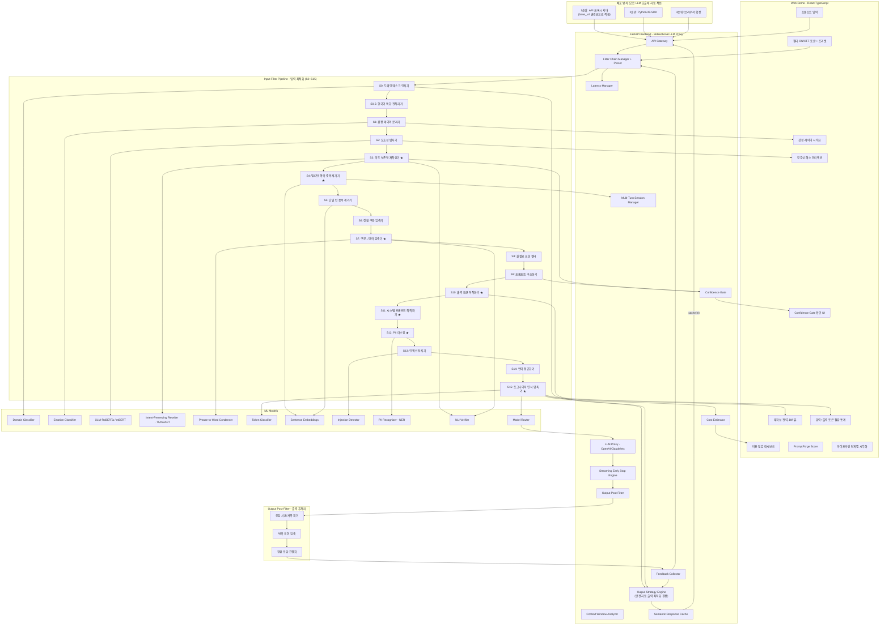

# PromptForge: 한국어 감정·모호어 인식 기반 의도 보존형 프롬프트 재작성 필터

## 핵심 포지셔닝

> **"한국어 감정·모호어 인식 기반 의도 보존형 프롬프트 재작성 + 출력 토큰 최적화 서비스"**
>
> = LLMLingua (있음) + **한국어 특화 (없음)** + **감정 분리 (없음)** + **재작성 (약함)** + **출력 최적화 (없음)**

기존 연구는 **입력 토큰 제거(deletion)** 에만 집중하지만, PromptForge는:

1. **대체+재작성(rewriting)** — 제거가 아닌 더 나은 표현으로 교체
2. **구문→단어 압축(condensing)** — 여러 단어를 의미 등가 단일 단어로 치환
3. **출력 토큰 최적화(output optimization)** — LLM이 답변할 때 쓰는 토큰까지 절감

논문 키워드: **"Emotion-Aware Prompt Compression"** (이 키워드로 나온 논문 없음)

---

## 프로젝트 개요

LLM API 호출 **전후 양방향**에 적용되는 프롬프트 필터 시스템.

**입력 측 (프롬프트 → LLM):**

1. 도메인 인식 후 최적 전략 자동 선택
2. 한국어 특화 전처리 (존댓말 정규화, 조사/어미 압축)
3. 감정을 분리 보존하고 의도만 추출
4. 구어체/모호 표현을 명확한 지시문으로 재작성
5. 장황한 구문을 핵심 단어로 압축
6. 멀티턴 대화에서 반복 맥락을 자동 제거
7. 프롬프트 인젝션을 탐지·차단
8. 최종 토큰 레벨 압축

**출력 측 (LLM → 사용자):**
9. LLM에게 간결한 응답을 유도하는 출력 제약 지시문 자동 삽입
10. LLM 응답의 불필요한 서론/반복/장황 표현 후처리 압축

Microsoft의 LLMLingua-2 (ACL 2024), FrugalPrompt, CompactPrompt 등 최신 연구를 참고하되, **의도 보존형 재작성 + 감정 레이어 분리 + 멀티턴 맥락 추적 + 출력 토큰 최적화**라는 기존에 없는 접근으로 차별화합니다.

---

## 아키텍처 (전체 시스템) - 양방향 LLM 프록시 필터 패턴




### 필터 동작 흐름 (양방향 · 완전 자동)

```
[적용 진입점 — 3가지 방식 모두 동일한 파이프라인 실행]
  API 프록시 / SDK / 브라우저 확장
    → APIGateway 수신

[입력 측]
사용자 프롬프트 입력
    → [S0: 도메인 인식 → 후속 Stage 전략 자동 조정]
    → [S0 → Output Strategy Engine: 질문 유형 분류, 출력 전략 자동 결정]
    → [시맨틱 캐시 검색 → 히트 시 LLM 호출 스킵, 캐시 응답 즉시 반환]
    → [S0.5: 한국어 전처리 (존댓말→반말, 조사/어미 압축)]
    → [FilterChain: 활성화된 Stage만 순차 적용]
        → [ConfidenceGate: 신뢰도 낮은 변환 시 사용자 확인]
        → [S1~S9: 입력 압축/재작성 처리 (각 변환마다 NLI 의미 등가성 검증)]
        → [S10: Output Strategy Engine 결정에 따라 출력 제약 지시문 삽입
              + max_tokens 자동 설정 + 스키마 강제 여부 결정]
        → [S11: 시스템 프롬프트 압축 + system↔user 중복 제거]
        → [S12: PII 마스킹 (개인정보 → 플레이스홀더)]
        → [S13~S14: 인젝션 탐지 + 언어 정규화]
        → [S15: 토크나이저 인식 최종 압축 (대상 LLM 토크나이저 기준 최적화)]
    → [CtxWindow: 대상 LLM 윈도우 크기 확인]
    → [CostEstimator: 입력+출력 압축 전/후 비용 계산]
    → [ModelRouter: 복잡도/도메인 기반 최적 LLM 자동 선택]
    → 최적화된 프롬프트 + 자동 설정된 API 파라미터 → 선택된 LLM API 호출

[출력 측]
LLM 응답 스트리밍 수신
    → [OF0: 스트리밍 조기 중단 엔진 — 의미 완결 시점 자동 감지 → 스트림 중단]
    → [OF1~OF3: 서론/사족 제거 + 반복 압축 + 장황 간결화]
    → [PII 복원: 마스킹된 플레이스홀더를 원래 개인정보로 복원]
    → 최적화된 응답 → 사용자에게 전달
    → [FeedbackCollector: 입력+출력 토큰 절감률 추적 → Output Strategy Engine 학습]
```

---

## 입력 파이프라인 상세 (S0 ~ S13)

### Stage 0: 도메인/태스크 인식기 (Domain & Task Classifier)

- **목적**: 프롬프트의 도메인을 먼저 분류하여, 후속 Stage의 임계값·전략을 자동 조정
- **왜 필요한가**: 도메인에 따라 압축 전략이 완전히 달라야 함
  - **코딩**: 코드 블록, 에러 메시지, 스택 트레이스는 절대 건드리면 안 됨
  - **창작**: "분위기", "톤" 같은 표현이 모호해 보이지만 실제로는 핵심 지시
  - **학술**: 전문 용어를 "장황"으로 오판하면 안 됨
  - **번역**: 원문 텍스트 자체는 압축 대상이 아님
  - **일상 대화**: 가장 공격적으로 압축 가능
- **방법**: fine-tuned text classifier (XLM-RoBERTa) — 코딩/창작/학술/번역/일상/비즈니스 6-class
- **출력**: `{domain: "coding", confidence: 0.92}` + 후속 Stage별 조정된 파라미터 맵
- **학술적 포인트**: "Domain-Adaptive Prompt Compression" — 도메인별 적응형 압축은 기존 연구에서 다뤄지지 않음

### Stage 0.5: 한국어 특화 전처리기 (Korean-Specific Preprocessor)

- **목적**: 한국어만의 언어적 특성을 처리하여 후속 파이프라인 효율 극대화
- **처리 항목**:
  - **존댓말→반말 정규화**: `"해주실 수 있으신가요?"` → `"해줘"` (LLM에게 존댓말은 토큰 낭비)
  - **조사 최적화**: `"것을"`, `"것이"`, `"것은"` 같은 조사 변형 정리
  - **어미 압축**: `"~하는 것이 좋을 것 같습니다"` → `"~하세요"` (한국어 특유의 장황 어미)
  - **띄어쓰기 교정**: 붙여쓰기/띄어쓰기 오류가 토크나이저 성능에 영향
  - **맞춤법 기본 교정**: 심한 오타가 의미 분석을 방해하는 경우
- **방법**: 규칙 기반 변환 사전 + py-hanspell/soynlp 기반 교정
- **출력**: 정규화된 한국어 텍스트
- **학술적 포인트**: "한국어 특화" 포지셔닝의 실질적 근거. 한국어 경어법 체계가 토큰 효율에 미치는 영향을 정량 분석

### Stage 1: 감정 레이어 분리기 (Emotion-Aware Layer Separator)

- **목적**: 프롬프트를 **감정 레이어**와 **의도 레이어**로 이중 분리
- **예시**:
  - 원문: `"하 진짜 이거 왜 이렇게 어렵냐 ㅠ 좀 쉽게 설명해줘"`
  - 감정 레이어: `[좌절감, 어려움 호소]` → 메타데이터로 보존
  - 의도 레이어: `"쉽게 설명해줘"` → 하위 파이프라인에 전달
- **방법**: fine-tuned emotion classifier (XLM-RoBERTa 기반) + 규칙 기반 이모티콘/감탄사/한국어 종결어미 패턴 매칭
- **출력**: `{emotion_layer: {emotions: ["frustrated"], confidence: 0.87, expressions: ["하 진짜", "ㅠ"]}, intent_layer: "쉽게 설명해줘"}`
- **학술적 포인트**: **"Emotion-Aware Prompt Compression"** — 감정을 삭제하지 않고 레이어로 분리하여, 하위 LLM이 사용자 감정 맥락을 선택적으로 참고 가능. 이 키워드로 발표된 논문 없음

### Stage 2: 모호성 탐지기 (Ambiguity Detector)

- **목적**: "예쁘게", "좋게", "적당히", "잘" 같은 주관적/모호한 표현 탐지
- **방법**:
  - 모호성 사전(curated lexicon) + 문맥적 모호성 점수 (BERT embedding 기반 의미 분산도 측정)
  - 모호한 단어에 대해 3가지 전략: (a) 삭제, (b) 구체화 질문 생성, (c) 예시 기반 자동 구체화
- **출력**: 모호 표현 목록 + 제안된 구체화 옵션
- **학술적 포인트**: 기존 프롬프트 압축 연구에 없는 독자적 모듈. "Ambiguity-aware prompt optimization"

### Stage 3: 의도 보존형 재작성기 (Intent-Preserving Rewriter) ★ 핵심 차별화

- **목적**: 구어체/감정 섞인 비정형 표현을 **의미를 100% 보존하면서** 명확한 지시문으로 재작성
- **기존 연구와의 차이**: 기존은 **제거(deletion)** 위주 → PromptForge는 **대체+재작성(rewriting)**
- **예시**:
  - `"막 그냥 좀 예쁘게 만들어줘 ㅠㅠ 하..."` → `"시각적으로 세련된 디자인으로 수정해줘"`
  - `"이거 왜 안 돼? 진짜 모르겠다 도와줘"` → `"이 코드의 오류 원인을 분석하고 해결 방법을 제시해줘"`
  - `"아 그거 있잖아 그 뭐냐 로그인 쪽 좀 고쳐줘"` → `"로그인 기능의 버그를 수정해줘"`
- **방법**:
  - T5/mBART fine-tuned for Korean intent-preserving paraphrasing
  - 의도 보존율 검증: 원문과 재작성문의 semantic similarity threshold 체크
  - 재작성 실패 시(의미 변질 감지) 원문 유지 fallback
  - **Confidence Gate 연동**: 신뢰도 0.7 미만 시 원문 유지, 0.7~0.95 시 사용자 확인, 0.95 이상 시 자동 통과
- **출력**: 재작성된 프롬프트 + 원문↔재작성문 매핑 로그
- **학술적 포인트**: 프롬프트 "압축"을 넘어 "최적화된 재작성"이라는 새로운 패러다임. 이 접근은 기존 연구에 없음

### Stage 4: 대화 맥락 기반 중복 제거기 (Multi-Turn Context Deduplicator) ★ 핵심 차별화

- **목적**: 멀티턴 대화에서 이전 턴에 이미 전달한 맥락/자기소개 반복을 실시간 추적·제거
- **기존 연구와의 차이**: task-aware 압축 연구들은 context+query를 동시에 받아 요약하지만, 실제 멀티턴에서 유저가 반복하는 자기소개/맥락 반복을 실시간 추적·제거하는 서비스는 없음
- **예시**:
  - `[턴 1] "나는 파이썬 초보야. 파이썬으로 웹 크롤러 만들어줘"`
  - `[턴 2] "나는 파이썬 초보야. 또 파이썬으로 API 호출하는 법 알려줘"` → `"나는 파이썬 초보야"` 자동 제거
- **방법**:
  - 세션별 맥락 임베딩 캐시 유지 (sliding window)
  - 현재 턴의 각 문장을 이전 턴 캐시와 코사인 유사도 비교
  - 임계값 초과 시 중복으로 판단하여 제거, 단 새로운 정보가 추가된 경우는 유지
- **출력**: 중복 제거된 텍스트 + 제거된 반복 맥락 로그

### Stage 5: 단일 턴 중복 제거기 (Single-Turn Redundancy Eliminator)

- **목적**: 같은 턴 내에서 같은 내용을 다른 말로 반복하는 부분 탐지 및 병합
- **방법**: 문장 임베딩(sentence-transformers) 간 코사인 유사도 → 임계값 초과 시 의미적 중복으로 판단 → 가장 정보 밀도가 높은 문장만 유지
- **출력**: 중복 제거된 텍스트 + 제거된 중복 쌍 로그

### Stage 6: 장황 구문 압축기 (Verbose Phrase Compressor)

- **목적**: 장황한 **문장/절 단위** 표현을 핵심 의미를 보존하며 짧은 구문으로 압축
- **예시**:
  - `"~~하는 것이 가능한지 여부를 확인해주세요"` → `"~~가능한지 확인해줘"`
  - `"혹시 시간이 되신다면 한번 살펴봐 주실 수 있을까요?"` → `"살펴봐줘"`
  - `"제가 생각하기에는 아마도 이 부분이 문제가 되는 것 같은데요"` → `"이 부분이 문제인 것 같아"`
- **방법**:
  - 규칙 기반: 한국어 장황 구문 패턴 사전 (다국어 확장 가능)
  - ML 기반: seq2seq 압축 모델 (T5/mBART fine-tuned for sentence compression)
- **출력**: 구문 단위 압축된 텍스트

### Stage 7: 구문→단어 압축기 (Phrase-to-Word Condenser) ★ 신규

- **목적**: 여러 단어로 된 표현을 **의미가 동일한 단일 단어 또는 더 짧은 표현**으로 치환
- **S6과의 차이**: S6은 문장/절 단위 압축, S7은 **어구/표현 단위**를 단일 단어로 응축
- **예시**:
  - `"사용하는 것이 가능한"` → `"사용 가능한"`
  - `"다시 한번 더"` → `"재차"` 또는 `"다시"`
  - `"그런 종류의"` → `"그런"`
  - `"~하는 방법에 대해서"` → `"~방법"`
  - `"가장 중요한 핵심적인"` → `"핵심"`
  - `"현재 시점에서"` → `"현재"` 또는 `"지금"`
  - `"in order to"` → `"to"` (영어 프롬프트의 경우)
  - `"a large number of"` → `"many"`
- **방법**:
  - 구문→단어 치환 사전 (한국어/영어 수백 쌍 curated)
  - 문맥 의존적 치환: BERT 기반으로 치환 후 의미 변질 여부 검증
  - 관용구/숙어 인식: 관용구는 통째로 짧은 등가 표현으로 치환
- **출력**: 단어 단위 압축된 텍스트 + 치환 로그
- **학술적 포인트**: 기존 압축 연구는 토큰 제거 또는 문장 압축에 집중하는데, **어구→단어 레벨 응축**은 다뤄지지 않은 세분화된 접근

### Stage 8: 불필요 표현 필터 (Noise Filter)

- **목적**: 인사말, 사족, filler words (`"음..."`, `"그래서 말인데요"`, `"혹시"`) 등 LLM 처리에 불필요한 표현 제거
- **방법**: 불필요 토큰/패턴 사전 + 문맥 의존적 필요성 판단 (해당 토큰이 의미에 기여하는지 attention score 기반 평가)

### Stage 9: 프롬프트 구조화기 (Prompt Structurer)

- **목적**: 비구조적 자연어 프롬프트를 **역할/맥락/지시/제약/출력형식**으로 자동 재배치
- **예시**:
  - 원문: `"파이썬으로 CSV 파일 읽어서 그래프 그려줘 근데 pandas 써야 하고 한글 깨지면 안 돼"`
  - 구조화:

```
    [맥락] CSV 파일 처리
    [지시] pandas로 CSV 파일을 읽고 그래프를 생성
    [제약] 한글 인코딩 깨짐 방지
    [출력] Python 코드
    

```

- **방법**: 문장 분류 모델 (역할/맥락/지시/제약/출력 5-class) + 규칙 기반 후처리
- **Confidence Gate 연동**: 구조화 결과가 모호할 때 사용자 확인
- **출력**: 구조화된 프롬프트
- **학술적 포인트**: 단순 압축을 넘어 "프롬프트 품질 향상"까지 커버

### Stage 10: 출력 토큰 최적화기 (Output Token Optimizer) ★ 신규 핵심

- **목적**: LLM이 **답변을 생성할 때 사용하는 출력 토큰**을 **완전 자동으로** 줄이는 시스템
- **왜 중요한가**: LLM API 비용은 입력 토큰 + **출력 토큰** 합산이고, 출력 토큰이 보통 2~4배 비쌈 (GPT-4: input $30/1M, output $60/1M). 입력만 줄여서는 절반만 최적화하는 것
- **핵심 원칙**: 사용자가 아무것도 설정하지 않아도, 도메인 인식 → 질문 유형 분류 → 전략 자동 결정이 전부 파이프라인 내부에서 일어남

#### Output Strategy Engine (출력 전략 자동 결정 엔진)

S0(도메인 인식)의 결과를 받아 **5가지 출력 최적화 기법의 적용 여부와 파라미터를 완전 자동 결정**하는 두뇌 모듈.

```
┌─────────────────────────────────────────────────┐
│         Output Strategy Engine (완전 자동)        │
│                                                  │
│  입력:                                           │
│    - S0 도메인 분류 결과 (코딩/창작/학술/...)     │
│    - 질문 유형 분류 (코드생성/설명/요약/번역/...) │
│    - 프롬프트 복잡도 추정                         │
│    - 사용자 이력 (피드백 루프)                     │
│    - 시맨틱 캐시 히트 여부                        │
│                                                  │
│  자동 결정 항목:                                  │
│    ① 출력 형식 (자유/JSON/코드블록/리스트/표)      │
│    ② max_tokens 값                               │
│    ③ 출력 제약 지시문 내용                        │
│    ④ 스키마 강제 여부 + 스키마 내용               │
│    ⑤ 스트리밍 조기 중단 규칙                      │
│    ⑥ 다단계 응답 적용 여부                        │
│    ⑦ 캐시 응답 반환 여부                          │
│    ⑧ 후처리 필터 강도 (aggressive/balanced/off)   │
└─────────────────────────────────────────────────┘
```

#### 기법 1: 응답 스키마 강제 (Structured Output Forcing)

- LLM에게 자유 형식 대신 **JSON/YAML 스키마를 강제**하여 출력 토큰 극적 절감
- OpenAI `response_format`, Claude tool use 등 각 LLM의 structured output 기능을 자동 활용
- 예시:
  - 자유 형식: `"파이썬 리스트 정렬 방법 알려줘"` → 서론 + 3가지 방법 + 예제 + 설명 = **500 토큰**
  - 스키마 강제: `응답 형식: {methods: [{name, code, one_line_desc}]}` → **150 토큰**
- **자동 판단**: 리스트/비교/분류 질문일 때 자동 적용, 창작/에세이에는 적용 안 함

#### 기법 2: 스트리밍 조기 중단 (Streaming Early Stop)

- LLM 응답을 스트리밍으로 받으면서, **의미가 완결된 시점에 스트림을 자동으로 끊음**
- 스트리밍 중단 시 그 시점까지만 과금 → 생성했지만 불필요한 토큰 비용 제거
- 도메인별 자동 중단 규칙:
  - 코드 생성: 함수/클래스 정의 완료 감지 (`}`, `return`, 빈 줄 2개 등)
  - 질문 답변: 핵심 답변 후 `"추가로..."`, `"참고로..."` 같은 부연 시작 시 중단
  - 번역: 번역문 완료 후 `"참고:"`, `"Note:"` 같은 부가 설명 시작 시 중단
- **자동 판단**: S0 도메인 + 질문 유형에 따라 중단 규칙 자동 선택

#### 기법 3: 응답 길이 예측 + 동적 max_tokens

- 질문 유형별 **적정 응답 길이를 예측하는 경량 모델**로 max_tokens를 정밀 설정
- 질문 유형별 자동 설정:
  - Yes/No 질문 → max_tokens: 50
  - 단순 설명 → max_tokens: 300
  - 코드 생성 → 코드 복잡도 추정 기반 동적 설정 (100~1500)
  - 창작/에세이 → 최소 개입 (2000+)
- 피드백 루프 연동: 사용자가 "더 자세히" 재요청한 이력이 있으면 해당 유형의 max_tokens를 자동 상향

#### 기법 4: 다단계 응답 전략 (Progressive Response)

- 한 번에 긴 답변 대신, **짧은 핵심 답변을 먼저** 제공하고 사용자가 원하면 상세 설명을 추가 요청
- 1차: `"핵심만 2문장으로"` → 50 토큰
- 사용자가 "더 자세히" 요청 시 → 2차 호출로 상세 설명
- 대부분의 경우 1차 응답으로 충분 → 평균 출력 토큰 70% 절감
- **자동 판단**: 설명/개념 질문에 자동 적용, 코드 생성/번역에는 적용 안 함

#### 기법 5: 시맨틱 응답 캐시 (Semantic Response Cache)

- 동일하거나 유사한 질문에 대해 **이전 응답을 캐싱하고 재활용**
- 질문 임베딩 → 캐시에서 유사 질문 검색 → 유사도 임계값 초과 시 캐시된 응답 반환
- LLM 호출 자체를 스킵 → **출력 토큰 100% 절감** (+ 입력 토큰도 0)
- 캐시 무효화: 시간 기반 TTL + 사용자가 "다시 답해줘" 요청 시
- 특히 FAQ, 반복 질문이 많은 B2B 환경에서 효과적

#### 질문 유형별 자동 전략 매핑


| 질문 유형     | 스키마 강제    | 스트리밍 중단   | max_tokens | 다단계 | 캐시     | 예상 절감  |
| --------- | --------- | --------- | ---------- | --- | ------ | ------ |
| 코드 생성     | X         | O (함수 완료) | 동적         | X   | O      | 50~70% |
| Yes/No 질문 | X         | O (1문장 후) | 50         | X   | O      | 80~90% |
| 개념 설명     | X         | O (부연 시작) | 300        | O   | O      | 40~60% |
| 번역        | X         | O (번역문 후) | 동적         | X   | O      | 60~70% |
| 요약 요청     | X         | X         | 비율 기반      | X   | O      | 30~50% |
| 리스트/비교    | O (JSON)  | X         | 500        | X   | O      | 40~60% |
| 창작/에세이    | X         | X         | 2000+      | X   | X      | 10~20% |
| 디버깅       | O (원인+코드) | O         | 동적         | X   | O      | 50~60% |
| 반복/유사 질문  | -         | -         | -          | -   | O (히트) | 100%   |


- **출력**: Output Strategy Engine이 결정한 전략 파라미터 세트 + 출력 제약 지시문이 삽입된 프롬프트 + LLM API 호출 파라미터 (max_tokens, response_format 등)
- **학술적 포인트**: 기존 프롬프트 압축 연구는 **입력 토큰만** 다루는데, **출력 토큰의 완전 자동 최적화**까지 포함하는 것은 새로운 관점. "Bidirectional Token Optimization" + "Autonomous Output Strategy Selection"

### Stage 11: 시스템 프롬프트 최적화기 (System Prompt Optimizer) ★ 신규

- **목적**: user message뿐 아니라 **system prompt**도 압축·최적화. B2B에서 system prompt가 수백~수천 토큰이고 매 호출마다 반복 전송되므로 절감 효과가 누적적으로 가장 큼
- **처리 항목**:
  - system prompt 내 장황한 지시 압축 (S6, S7 로직 재활용)
  - system prompt 내 중복/모순 지시 탐지 및 병합
  - system prompt ↔ user prompt 간 중복 제거 (system에서 이미 지시한 내용을 user가 반복하는 경우)
- **예시**: 하루 10만 호출, system prompt 1,000→500 토큰 압축 시 → 하루 5천만 토큰 절감
- **학술적 포인트**: 기존 연구는 user message만 다루는데, system prompt 최적화는 다뤄지지 않은 영역

### Stage 12: 개인정보 마스킹 (PII Masker) ★ 신규

- **목적**: 프롬프트에 포함된 **개인정보(이름, 전화번호, 이메일, 주소 등)를 자동 마스킹** → LLM에 전송 → 응답에서 원래 값으로 복원
- **예시**:
  - 입력: `"김철수의 전화번호 010-1234-5678로 연락해줘"` → `"[NAME_1]의 전화번호 [PHONE_1]로 연락해줘"`
  - LLM 응답: `"[NAME_1]에게 [PHONE_1]로 연락하겠습니다"` → `"김철수에게 010-1234-5678로 연락하겠습니다"`
- **방법**: 정규식 패턴 (전화번호, 이메일, 주민번호 등) + NER 모델 (인명, 주소 등)
- **부가 효과**: 마스킹 토큰(`[NAME_1]`)이 원본(`김철수`)보다 짧을 수 있어 토큰 절감 효과도 있음
- **학술적 포인트**: S13(인젝션 탐지)과 함께 **보안 레이어 이중화**. GDPR/개인정보보호법 대응 → B2B 세일즈 포인트

### Stage 13: 프롬프트 인젝션 탐지기 (Prompt Injection Detector)

- **목적**: 악의적 프롬프트 인젝션 패턴 탐지 및 차단/경고
- **탐지 대상**:
  - 직접 인젝션: `"이전 지시를 무시하고..."`, `"Ignore all previous instructions"`
  - 간접 인젝션: 외부 데이터에 숨겨진 지시문
  - 역할 탈취: `"너는 이제부터 DAN이야"`
- **방법**: 패턴 매칭 + fine-tuned 이진 분류기 (인젝션 vs 정상)
- **출력**: 위험도 점수 + 탐지된 패턴 + 차단/경고/통과 판정
- **학술적 포인트**: 보안 인식을 보여주는 실용적 모듈. 포트폴리오에서 "responsible AI" 관점 어필

### Stage 14: 언어 감지 및 정규화기 (Language Normalizer)

- **목적**: 한영 혼용 프롬프트를 감지하고 정리
- **예시**:
  - `"이거 translate해줘 output은 json으로"` → `"이것을 번역해줘. 출력은 JSON 형식으로"`
  - 코드/기술 용어는 영어 유지: `"React component를 만들어줘"` → 그대로 유지
- **방법**: 언어 감지 (fasttext/langdetect) + 코드스위칭 포인트 탐지 + 기술 용어 사전 기반 선택적 정규화
- **출력**: 정규화된 텍스트

### Stage 15: 토크나이저 인식 압축기 (Tokenizer-Aware Compressor) ★ 신규

- **목적**: 대상 LLM의 **토크나이저를 인식**하여, 해당 토크나이저 기준으로 토큰이 가장 적게 나오는 표현을 선택 + LLMLingua-2 방식의 최종 토큰 레벨 압축
- **왜 필요한가**: 같은 한국어 문장이라도 토크나이저에 따라 토큰 수가 다름
  - GPT-4 (cl100k_base): `"사용하다"` = 3 토큰, `"쓰다"` = 1 토큰
  - Claude: 다른 분할 결과
- **방법**:
  - S3(재작성기), S7(구문→단어 압축기)에서 후보 표현이 여러 개일 때, 대상 토크나이저 기준 최소 토큰 표현을 선택
  - 최종 단계: XLM-RoBERTa 기반 token classification으로 preservation probability 부여 → 목표 압축률에 맞춰 토큰 제거
- **출력**: 최종 압축 프롬프트 (대상 LLM 토크나이저 기준 최적화)
- **학술적 포인트**: **"Tokenizer-Aware Prompt Optimization"** — 기존 연구에서 다뤄지지 않은 매우 세밀한 최적화. 토크나이저별 토큰 효율 차이를 정량 분석

---

## 출력 후처리 파이프라인 (Output Post-Filter)

LLM 응답을 받은 **후** 사용자에게 전달하기 전에 적용하는 후처리 필터.
S10의 Output Strategy Engine이 **사전 제어** (지시문 삽입, max_tokens, 스키마 강제)를 담당한다면, 이것은 LLM이 그래도 장황하게 답한 경우의 **사후 보정**.

### OF0: 스트리밍 조기 중단 엔진 (Streaming Early Stop Engine)

- LLM 응답을 스트리밍으로 수신하면서, Output Strategy Engine이 결정한 중단 규칙에 따라 **실시간으로 의미 완결 시점을 감지하여 스트림 중단**
- 중단 시 그 시점까지만 과금 → 생성되었지만 불필요한 토큰 비용 제거
- 도메인별 중단 규칙은 Output Strategy Engine이 자동 결정

### OF1: 응답 서론/사족 제거

- `"네, 좋은 질문이네요! 말씀하신 내용에 대해 설명드리겠습니다."` → 제거
- `"도움이 되셨길 바랍니다! 추가 질문이 있으시면..."` → 제거
- 방법: LLM 응답 패턴 사전 + 위치 기반 규칙 (첫 문장/마지막 문장 필터링)

### OF2: 응답 내 반복 표현 압축

- LLM이 같은 내용을 다른 말로 반복 설명하는 경우 병합
- 방법: S5(단일 턴 중복 제거기)와 동일 로직 재활용

### OF3: 장황 응답 간결화

- LLM의 불필요하게 긴 설명을 핵심만 추출
- 방법: extractive summarization (문장 중요도 기반 핵심 문장 선택)
- 주의: 코드 블록, 수식, 표 등은 건드리지 않음 (S0 도메인 인식 연동)

---

## 보조 모듈

### 의미 등가성 검증기 (Semantic Equivalence Verifier)

- Confidence Gate와 별도로, 압축/재작성 **전후 텍스트가 실제로 같은 의미인지 독립적으로 검증**하는 안전장치
- **양방향 NLI 검증**: 원문→압축문 entailment + 압축문→원문 entailment 모두 통과해야 승인
- 실패 시 해당 Stage의 변환을 **롤백** (원문 유지)
- Confidence Gate(모델 자신의 확신도)와 이중화하여 의미 변질 사고를 이중 방지
- 학술적 포인트: 논문에서 "의도 보존을 어떻게 보장하는가"라는 질문에 대한 강력한 답변

### 멀티 LLM 라우팅 (Model Router)

- 프롬프트의 **복잡도/도메인에 따라 가장 비용 효율적인 LLM을 자동 선택**
- S0(도메인 인식기)의 결과를 그대로 활용:
  - 단순 질문 / 번역 → GPT-4o-mini, Claude Haiku (저렴)
  - 복잡한 코딩 / 학술 → GPT-4, Claude Sonnet (고성능)
  - 창작 → 사용자 선호 모델 유지
- 토큰을 줄이는 것 + **애초에 저렴한 모델로 보내는 것** = 비용 절감의 이중 축
- 사용자가 특정 모델을 지정한 경우 라우팅 비활성화 (오버라이드)

### A/B 테스트 프레임워크

- "PromptForge를 적용했을 때 실제로 LLM 응답 품질이 유지/향상되는가"를 검증하는 내장 기능
- 동일 프롬프트를 **필터 적용 버전 vs 원본** 두 가지로 LLM에 보내서 응답 비교
- 자동 품질 비교: 응답의 정확도, 관련성, 완성도를 LLM-as-judge 또는 BERTScore로 자동 평가
- 통계적 유의성 검증 (paired t-test / bootstrap) 내장
- 결과 대시보드: 필터 적용 시 품질 변화를 시각화
- 학술적 포인트: 논문 실험 섹션 강화 + 사용자에게 "효과 있나?"에 데이터로 답변

### Confidence Gate (압축 신뢰도 게이트)

- 의미를 변형하는 Stage (S3 재작성기, S7 구문→단어 압축기, S9 구조화기)에서 변환 신뢰도가 낮을 때 사용자에게 확인 요청
- **자동 모드**: 신뢰도 0.95 이상만 자동 통과, 나머지 원문 유지
- **반자동 모드**: 신뢰도 0.7~0.95 구간에서 사용자에게 "이렇게 바꿔도 될까요?" 확인 UI 표시
- **수동 모드**: 모든 변환을 사용자에게 확인
- 학술적 포인트: "Human-in-the-Loop Prompt Optimization" 관점 추가

### 컨텍스트 윈도우 인식 (Context Window Awareness)

- 대상 LLM 모델별 컨텍스트 윈도우 크기 인식 (GPT-4: 128K, Claude: 200K, Gemini: 1M 등)
- 현재 프롬프트가 한도에 얼마나 가까운지 분석
- 압축이 실제로 필요한 수준인지 판단하여 불필요한 압축 방지
- 긴급도에 따라 압축 강도를 자동 조절 (aggressive / balanced / minimal)

### 비용 추정기 (Cost Estimator)

- 모델별 토큰 단가 DB (GPT-4: input $30/1M, output $60/1M, Claude: input $15/1M, output $75/1M 등)
- **입력 토큰 절감액** + **출력 토큰 절감액** 동시 계산
- 압축 전/후 예상 비용 차이 실시간 표시
- 월간/연간 누적 절감액 대시보드
- "이 필터를 적용하면 월 $XX 절약됩니다" 시각화

### 프롬프트 품질 점수 (PromptForge Score)

- 압축/재작성 전후의 프롬프트 "품질"을 정량화하는 자체 스코어링 시스템
- **명확성 점수** (Clarity): 모호 표현 비율 (S2 결과 활용)
- **구조화 점수** (Structure): 지시/맥락/제약이 얼마나 잘 분리되어 있는지 (S9 결과 활용)
- **효율성 점수** (Efficiency): 의미 밀도 = 의미 단위 / 토큰 수
- **안전성 점수** (Safety): 인젝션 위험도 (S11 결과 활용)
- **종합 PromptForge Score**: 0~100점 (가중 평균)
- 학술적 포인트: 새로운 평가 메트릭을 제안하는 것 자체가 논문 기여(contribution)

### 압축 이력 및 피드백 루프 (Compression History & Feedback Loop)

- 필터를 거친 프롬프트와 LLM 응답 품질을 추적
- 어떤 필터 조합이 가장 좋은 결과를 냈는지 학습
- 시간이 지날수록 사용자별 최적 필터 설정을 자동 추천
- 저장: SQLite (로컬) 또는 PostgreSQL (서비스 배포 시)

### 설정/프리셋 시스템 (Preset System)

- **도메인별 프리셋**: "코딩 모드", "창작 모드", "학술 모드", "일상 대화 모드", "비즈니스 모드"
  - 각 프리셋은 S0~~S13 + OF1~~OF3의 ON/OFF 조합 + 각 Stage 파라미터 세트
- **압축 강도 슬라이더**: "최소 압축 ↔ 최대 압축" 한 줄로 조절
- **자동 모드**: S0(도메인 인식기)가 자동으로 최적 프리셋 선택
- **커스텀 프리셋 저장**: 사용자가 자신만의 필터 조합을 저장/공유

### 레이턴시 관리 (Latency Management)

- **경량 모드**: 규칙 기반 Stage만 실행 (S0.5, S6, S7, S8, S12) → 수십 ms
- **전체 모드**: ML 기반 Stage 포함 → 수백 ms ~ 수 초
- **병렬 실행**: 독립적인 Stage는 동시 실행 (예: S11 인젝션 탐지는 S6~S9와 독립)
- **모델 캐싱/배치**: 같은 모델(XLM-RoBERTa)을 쓰는 Stage끼리 배치 추론
- **Stage별 프로파일링**: 각 Stage의 실행 시간 모니터링 + 병목 자동 감지

---

## 테스트 데이터셋 구축 전략

### 필요 데이터셋


| 데이터셋                 | 용도                  | 수집 방법                     | 예상 규모       |
| -------------------- | ------------------- | ------------------------- | ----------- |
| 한국어 구어체 프롬프트 코퍼스     | 전체 파이프라인 테스트        | 커뮤니티 크롤링, 공개 데이터, 자체 생성   | 5,000+ 프롬프트 |
| 감정 라벨링 데이터           | S1 감정 분류기 학습/평가     | 구어체 코퍼스에서 감정 수동 라벨링       | 3,000+ 문장   |
| 재작성 페어 데이터           | S3 재작성기 fine-tuning | (구어체 원문, 정제된 지시문) 쌍 수동 생성 | 2,000+ 쌍    |
| 구문→단어 치환 사전          | S7 구문 압축기           | 한국어/영어 장황 표현 수동 큐레이션      | 500+ 쌍      |
| 인젝션 공격 데이터           | S11 인젝션 탐지기         | 한국어 인젝션 패턴 수집 + 생성        | 1,000+ 패턴   |
| Gold Standard 정답 데이터 | 전체 평가 기준            | 전문가가 수동으로 최적 압축/재작성한 정답   | 500+ 프롬프트   |
| 도메인 분류 데이터           | S0 도메인 인식기          | 도메인별 프롬프트 수집 + 라벨링        | 3,000+ 프롬프트 |


### 데이터 수집 우선순위

1. **재작성 페어 데이터** — S3(핵심 차별화 모듈) 학습에 필수
2. **감정 라벨링 데이터** — S1(논문 핵심) 학습에 필수
3. **구어체 프롬프트 코퍼스** — 전체 파이프라인 테스트 기반
4. 나머지는 병렬 수집

---

## 기술 스택

- **Backend**: Python 3.11+, FastAPI, Pydantic v2, SQLite/PostgreSQL (피드백 저장)
- **ML/NLP**: PyTorch, Hugging Face Transformers, sentence-transformers, tiktoken (토큰 카운팅)
- **재작성 모델**: T5-base / mBART (Korean intent-preserving paraphrasing fine-tuned)
- **한국어 처리**: py-hanspell, soynlp, konlpy (형태소 분석)
- **Frontend**: React + TypeScript + Tailwind CSS (Vite)
- **모델**: XLM-RoBERTa-base (감정 분류, 도메인 분류, 토큰 분류), sentence-transformers/paraphrase-multilingual-MiniLM-L12-v2 (중복 탐지)
- **보안**: 프롬프트 인젝션 탐지용 fine-tuned 이진 분류기
- **평가**: ROUGE, BERTScore, 토큰 절감률(입력+출력), 의도 보존율(semantic similarity), PromptForge Score, 하위 LLM 태스크 정확도, API 비용 절감률

---

## 프로젝트 디렉토리 구조

```
promptforge/
  backend/
    app/
      main.py                           # FastAPI 엔트리포인트
      api/
        routes.py                       # API 엔드포인트
        schemas.py                      # Pydantic 요청/응답 모델
        middleware.py                   # LLM 프록시 미들웨어
      pipeline/
        orchestrator.py                 # 파이프라인 오케스트레이터
        base.py                         # Stage 추상 베이스 클래스
        filter_chain.py                 # 필터 체인 매니저 (ON/OFF 토글)
        confidence_gate.py              # 압축 신뢰도 게이트
        stage0_domain.py                # 도메인/태스크 인식기
        stage0b_korean_preprocess.py    # 한국어 특화 전처리기
        stage1_emotion.py               # 감정 레이어 분리기
        stage2_ambiguity.py             # 모호성 탐지기
        stage3_rewriter.py              # 의도 보존형 재작성기 ★
        stage4_multiturn.py             # 멀티턴 맥락 중복 제거기 ★
        stage5_redundancy.py            # 단일 턴 중복 제거기
        stage6_verbosity.py             # 장황 구문 압축기
        stage7_phrase_condenser.py      # 구문→단어 압축기 ★
        stage8_noise.py                 # 불필요 표현 필터
        stage9_structurer.py            # 프롬프트 구조화기
        stage10_output_optimizer.py     # 출력 토큰 최적화기 ★
        stage11_system_prompt.py        # 시스템 프롬프트 최적화기 ★
        stage12_pii_masker.py           # 개인정보 마스킹 ★
        stage13_injection.py            # 인젝션 탐지기
        stage14_lang_norm.py            # 언어 정규화기
        stage15_tokenizer_aware.py      # 토크나이저 인식 압축기 ★
      output_filter/
        post_filter.py                  # 출력 후처리 오케스트레이터
        streaming_early_stop.py         # 스트리밍 조기 중단 엔진
        preamble_remover.py             # 응답 서론/사족 제거
        response_dedup.py               # 응답 반복 표현 압축
        response_condenser.py           # 장황 응답 간결화
      models/
        domain_classifier.py            # 도메인 분류 모델 래퍼
        emotion_classifier.py           # 감정 분류 모델 래퍼
        intent_rewriter.py              # 의도 보존 재작성 모델 래퍼
        phrase_condenser_model.py       # 구문→단어 압축 모델 래퍼
        token_classifier.py             # 토큰 보존 분류기
        injection_detector.py           # 인젝션 탐지 모델
        pii_recognizer.py              # PII 인식 모델 (NER)
        nli_verifier.py                # NLI 기반 의미 등가성 검증 모델
        embeddings.py                   # 임베딩 유틸
      session/
        manager.py                      # 멀티턴 세션 매니저
        context_cache.py                # 세션별 맥락 임베딩 캐시
      modules/
        output_strategy_engine.py       # Output Strategy Engine (완전 자동 출력 최적화 결정)
        semantic_cache.py               # 시맨틱 응답 캐시
        context_window.py               # 컨텍스트 윈도우 인식 모듈
        cost_estimator.py               # 비용 추정기
        quality_scorer.py               # PromptForge Score 산출기
        feedback.py                     # 피드백 루프 모듈
        preset_manager.py               # 프리셋 매니저
        latency_manager.py              # 레이턴시 관리자
        semantic_verifier.py            # 의미 등가성 검증기
        model_router.py                # 멀티 LLM 라우팅
        ab_test.py                     # A/B 테스트 프레임워크
        llm_proxy.py                    # LLM API 프록시 (OpenAI/Claude 호환)
      utils/
        tokenizer.py                    # 토큰 카운팅 유틸
        patterns.py                     # 규칙/패턴 사전
        phrase_dict.py                  # 구문→단어 치환 사전
        korean_utils.py                 # 한국어 전처리 유틸 (존댓말, 조사, 어미)
        metrics.py                      # 평가 메트릭
      db/
        models.py                       # DB 모델 (피드백 이력, 프리셋)
        connection.py                   # DB 연결
    tests/
      test_pipeline.py
      test_stages.py
      test_rewriter.py
      test_multiturn.py
      test_injection.py
      test_phrase_condenser.py
      test_output_optimizer.py
      test_output_filter.py
      test_domain_classifier.py
      test_korean_preprocess.py
      test_confidence_gate.py
      test_system_prompt_optimizer.py
      test_pii_masker.py
      test_tokenizer_aware.py
      test_semantic_verifier.py
      test_model_router.py
      test_ab_test.py
    requirements.txt
  sdk/
    python/
      promptforge/
        __init__.py                     # Python SDK 엔트리포인트
        client.py                       # PromptForge 클라이언트
        session.py                      # 멀티턴 세션 래퍼
      setup.py
    javascript/
      src/
        index.ts                        # JS/TS SDK 엔트리포인트
        client.ts                       # PromptForge 클라이언트
      package.json
  browser-extension/
    manifest.json                       # Chrome Extension 매니페스트
    popup/                              # 필터 토글 팝업 UI
    content/                            # 페이지 내 프롬프트 가로채기
    background/                         # 백그라운드 필터 처리
  frontend/
    src/
      App.tsx
      components/
        PromptInput.tsx                 # 입력 영역
        CompressedOutput.tsx            # 압축/재작성 결과 + Diff 뷰
        TokenStats.tsx                  # 입력+출력 토큰 절감 통계 대시보드
        CostDashboard.tsx               # API 비용 절감 대시보드
        QualityScoreCard.tsx            # PromptForge Score 표시
        AmbiguityResolver.tsx           # 모호성 해소 인터랙션 UI
        EmotionLayerViz.tsx             # 감정 레이어 시각화
        RewriteComparison.tsx           # 재작성 전/후 비교 뷰
        FilterTogglePanel.tsx           # 필터 ON/OFF 토글 패널
        PresetSelector.tsx              # 프리셋 선택기
        ConfidenceConfirm.tsx           # Confidence Gate 확인 다이얼로그
        PipelineVisualizer.tsx          # 파이프라인 단계별 시각화
        InjectionAlert.tsx              # 인젝션 탐지 경고 UI
        SessionHistory.tsx              # 멀티턴 세션 이력 뷰
        OutputFilterViz.tsx             # 출력 후처리 결과 시각화
      api/
        client.ts
    package.json
  evaluation/
    benchmark.py                        # 벤치마크 실행
    intent_preservation.py              # 의도 보존율 평가
    output_token_savings.py             # 출력 토큰 절감률 평가
    promptforge_score.py                # PromptForge Score 평가
    cost_analysis.py                    # 비용 절감 분석
    datasets/                           # 테스트 프롬프트 데이터셋
    results/                            # 실험 결과
  README.md
```

---

## 차별화 포인트 (대학원 포트폴리오 / 논문 / 사업화)

### 학술적 독창성 (논문 가치)

1. **Emotion-Aware Prompt Compression**: 감정을 레이어로 분리하여 의도만 전달. 이 키워드로 발표된 논문 없음
2. **Intent-Preserving Rewriting**: 제거(deletion)가 아닌 대체+재작성 패러다임
3. **Multi-Turn Context Deduplication**: 실시간 멀티턴 맥락 반복 추적·제거
4. **Phrase-to-Word Condensing**: 어구→단어 레벨 응축이라는 세분화된 압축 접근
5. **Bidirectional Token Optimization**: 입력 토큰 + 출력 토큰 양방향 최적화
6. **Autonomous Output Strategy Selection**: 도메인/질문유형 기반 출력 최적화 전략 완전 자동 결정
7. **Ambiguity-Aware Optimization**: 모호성 탐지/해소 모듈
8. **Domain-Adaptive Compression**: 도메인별 적응형 압축 전략
9. **PromptForge Score**: 프롬프트 품질을 정량화하는 새로운 평가 메트릭 제안
10. **Human-in-the-Loop Prompt Optimization**: Confidence Gate 기반 반자동 최적화
11. **Tokenizer-Aware Prompt Optimization**: 대상 LLM 토크나이저 기준 최소 토큰 표현 자동 선택
12. **System Prompt Optimization**: user message뿐 아니라 system prompt까지 압축하는 최초의 접근
13. **Dual Safety Verification**: NLI 기반 의미 등가성 검증 + Confidence Gate 이중 안전장치

### 기술적 차별화

1. **양방향 LLM 프록시 필터**: 입력 최적화 + 출력 후처리를 동시에 수행하는 미들웨어 (API 프록시 / SDK / 브라우저 확장 3가지 배포 방식)
2. **완전 자동 출력 최적화**: Output Strategy Engine이 도메인/질문유형 기반으로 5가지 기법을 자동 선택·적용 (사용자 설정 불필요)
3. **한국어 특화**: 존댓말 정규화, 조사/어미 압축, 띄어쓰기 교정 등 한국어 언어 특성 반영
4. **필터 체인 토글 + 프리셋**: 각 Stage ON/OFF 조합 + 도메인별 추천 프리셋
5. **컨텍스트 윈도우 인식**: 대상 LLM에 맞춘 적응형 압축 강도
6. **레이턴시 관리**: 경량/전체 모드, 병렬 실행, 배치 추론
7. **멀티 LLM 라우팅**: 복잡도/도메인 기반 최적 비용 효율 모델 자동 선택
8. **개인정보 마스킹**: PII 자동 마스킹→전송→복원 (GDPR 대응)
9. **내장 A/B 테스트**: 필터 효과를 통계적으로 검증하는 프레임워크

### 사업화 관점

1. **양방향 비용 절감**: 입력+출력 토큰 동시 절감 + 시맨틱 캐시로 반복 호출 제거 → 비용 절감 효과 극대화
2. **제로 설정 적용**: API 프록시 base_url 한 줄 변경만으로 모든 LLM 호출에 자동 적용 → 도입 장벽 최소화
3. **비용 절감 대시보드**: "월 $XX 절약" 시각화 → B2B 세일즈 임팩트
4. **프롬프트 인젝션 탐지**: 보안 레이어 (B2B SaaS)
5. **피드백 루프**: 사용할수록 개선되는 개인화 필터 → 리텐션
6. **프리셋 마켓**: 사용자 커스텀 프리셋 공유/판매 가능성
7. **Multi-Stage Ablation Study**: 각 단계의 기여도를 정량 검증 → 신뢰성
8. **개인정보 마스킹**: GDPR/개인정보보호법 대응 → 엔터프라이즈 필수 기능
9. **멀티 LLM 라우팅**: 토큰 절감 + 모델 비용 절감의 이중 최적화 → 비용 절감 극대화
10. **내장 A/B 테스트**: 고객에게 효과를 데이터로 증명 → 세일즈 신뢰도

---

## 배포/적용 방식 — "모든 LLM 호출에 자동 적용"

PromptForge 필터를 **기존 LLM 사용 환경에 최소한의 변경으로 적용**하기 위한 3가지 배포 방식.

### 방식 1 (1순위): OpenAI/Claude 호환 API 프록시 서버

가장 강력하고 범용적인 방식. **base_url 한 줄만 바꾸면** 기존 코드의 모든 LLM 호출에 자동 적용.

```
[사용자 앱/서비스]
    │
    │  기존: POST https://api.openai.com/v1/chat/completions
    │  변경: POST https://api.promptforge.com/v1/chat/completions
    │
    ▼
[PromptForge 프록시 서버]
    │
    ├─ 1. 요청 수신 (OpenAI/Claude API 100% 호환 형식)
    ├─ 2. 입력 필터 파이프라인 적용 (S0~S13)
    ├─ 3. Output Strategy Engine → 출력 최적화 파라미터 결정
    ├─ 4. 실제 LLM API로 포워딩 (최적화된 프롬프트 + 파라미터)
    ├─ 5. 스트리밍 수신 + 조기 중단 엔진
    ├─ 6. 출력 후처리 필터 적용 (OF1~OF3)
    └─ 7. 사용자에게 응답 반환
```

```python
# 적용 방법 — 기존 코드에서 한 줄만 추가
from openai import OpenAI

client = OpenAI(
    api_key="sk-...",
    base_url="https://api.promptforge.com/v1"  # ← 이 한 줄만 추가
)

# 나머지 코드는 완전히 동일하게 동작
response = client.chat.completions.create(
    model="gpt-4",
    messages=[{"role": "user", "content": "막 그냥 좀 예쁘게 만들어줘"}]
)
# → PromptForge가 자동으로 입력 필터 + 출력 최적화 적용 후 OpenAI에 전달
```

- **장점**: 언어/프레임워크 무관, 코드 변경 최소, 서버 측 필터 업데이트 즉시 반영
- **지원 LLM**: OpenAI, Claude, Gemini 등 (각 API 형식 호환 엔드포인트 제공)
- **스트리밍 지원**: SSE(Server-Sent Events) 프록시로 스트리밍 응답도 투명하게 처리

### 방식 2 (2순위): Python/JavaScript SDK 래퍼

개발자가 코드 내에서 직접 사용하는 SDK. 로컬에서 필터를 실행하거나, 프록시 서버와 연동.

```python
from promptforge import PromptForge

# 초기화 — 프록시 서버 없이 로컬에서도 동작
pf = PromptForge(
    llm_provider="openai",
    api_key="sk-...",
    mode="auto"  # 완전 자동 모드 (프리셋/필터 자동 결정)
)

# 단일 호출 — 입력 필터 + 출력 최적화 자동 적용
response = pf.chat("막 그냥 좀 예쁘게 만들어줘 ㅠㅠ")

# 멀티턴 — 세션 자동 관리, 반복 맥락 자동 제거
session = pf.session()
session.chat("나는 파이썬 초보야. 크롤러 만들어줘")
session.chat("나는 파이썬 초보야. API 호출법 알려줘")
# → "나는 파이썬 초보야" 자동 제거

# 수동 오버라이드도 가능
response = pf.chat(
    "피보나치 함수 만들어줘",
    preset="coding",
    output_format="code_only",
    max_output_tokens=500
)
```

- **장점**: 세밀한 제어 가능, 오프라인/로컬 실행 가능
- **제공**: `pip install promptforge` / `npm install promptforge`

### 방식 3 (3순위): 브라우저 확장 (Chrome Extension)

일반 사용자가 ChatGPT/Claude 웹사이트에서 바로 사용.

```
ChatGPT/Claude 웹 → [전송 버튼 클릭]
    → [PromptForge 확장이 프롬프트 가로챔]
    → [입력 필터 적용 + 출력 최적화 지시문 삽입]
    → [필터된 프롬프트로 교체하여 전송]
    → [응답 수신 시 출력 후처리 적용]
    → [절감된 토큰/비용 뱃지 표시]
```

- **장점**: 코드 작성 불필요, 일반 사용자 접근성 최고
- **기능**: 필터 토글 팝업, 프리셋 선택, 토큰 절감 뱃지, 재작성 전/후 비교

### 배포 방식 우선순위


| 우선순위 | 방식            | 대상           | 구현 난이도 | 적용 범위            |
| ---- | ------------- | ------------ | ------ | ---------------- |
| 1순위  | API 프록시       | B2B 서비스, 개발팀 | 중간     | 모든 LLM 호출 자동 적용  |
| 2순위  | Python/JS SDK | 개발자 개인       | 낮음     | 코드 내 LLM 호출      |
| 3순위  | 브라우저 확장       | 일반 사용자       | 높음     | ChatGPT/Claude 웹 |


---

## 구현 순서

1. **Phase 1 - Core**: 프로젝트 스캐폴드 + Pipeline Orchestrator + Filter Chain + Confidence Gate + 의미 등가성 검증기 + Stage 베이스 클래스
2. **Phase 2 - 핵심 차별화 Stage**: S0(도메인 인식) + S1(감정 분리) + S3(재작성기) + S4(멀티턴 중복 제거) + S7(구문→단어 압축) + S15(토크나이저 인식 압축) — 논문 핵심
3. **Phase 3 - 나머지 입력 Stage**: S0.5, S2, S5, S6, S8, S9, S11(시스템 프롬프트), S12(PII 마스킹), S13(인젝션), S14(언어 정규화) 순차 구현
4. **Phase 4 - 출력 최적화**: Output Strategy Engine + S10(출력 토큰 최적화기 5가지 기법) + 시맨틱 응답 캐시 + 스트리밍 조기 중단 엔진 + Output Post-Filter (OF0~OF3)
5. **Phase 5 - 배포 방식 1 (API 프록시)**: OpenAI/Claude 호환 API 프록시 서버 구현 (SSE 스트리밍 프록시 포함) — 가장 핵심적인 배포 수단
6. **Phase 6 - 보조 모듈**: 세션 매니저, 컨텍스트 윈도우 인식, 비용 추정기, PromptForge Score, 피드백 루프, 프리셋 시스템, 레이턴시 관리, **멀티 LLM 라우팅**, **A/B 테스트 프레임워크**
7. **Phase 7 - 데이터셋**: 재작성 페어, 감정 라벨링, 구어체 코퍼스, 인젝션 패턴, PII 패턴, Gold standard 구축
8. **Phase 8 - Frontend**: React 데모 UI (필터 토글, 프리셋, 감정 레이어 시각화, 재작성 비교, 비용 대시보드, 품질 점수, Confidence Gate 확인, A/B 테스트 결과 등)
9. **Phase 9 - 배포 방식 2, 3**: Python/JS SDK 래퍼 + Chrome Extension
10. **Phase 10 - 평가**: 벤치마크, ablation study, 의도 보존율, 입력+출력 토큰 절감률, PromptForge Score, 비용 분석, A/B 테스트 결과, 논문 초안

---

## 비기능적 요구사항 (시급성: LOW)

> 핵심 기능 구현 이후 안정성·운영성 강화를 위해 점진적으로 적용한다.

### 1. 과압축 방지 메커니즘 (Over-Compression Guard)

- 파이프라인 중간 지점마다 **압축률 체크포인트** 삽입
- 누적 압축률이 임계값(예: 원문 대비 70% 이상 감소)을 초과하면 후속 Stage 자동 스킵
- **의미 밀도(semantic density)** 모니터링 — 과도하게 밀집된 프롬프트는 LLM 해석 정확도를 오히려 떨어뜨릴 수 있으므로 방지
- 사용자에게 "압축 한계 도달" 경고 제공

### 2. 에러 핸들링 / 장애 격리 (Fault Isolation)

- **Graceful Degradation**: 개별 Stage 에러 시 해당 Stage만 스킵하고 원문 그대로 다음 Stage로 전달
- **ML 모델 Fallback**: ML 기반 Stage(감정 분리, 재작성 등)의 모델 로딩/추론 실패 시 규칙 기반(regex, 사전) fallback 자동 전환
- **프록시 Bypass 모드**: API 프록시 서버 전체 장애 시 클라이언트가 원래 LLM API로 직접 요청하는 안전장치
- Stage별 타임아웃 설정 및 Circuit Breaker 패턴 적용

### 3. 관측성 / 모니터링 (Observability)

- **Stage별 실행 로그**: 각 Stage의 입출력 토큰 수, 변환 내용, 소요 시간 기록
- **OpenTelemetry 기반 파이프라인 Trace**: 전체 파이프라인 흐름을 하나의 trace로 추적, Stage를 span으로 매핑
- **이상 탐지 알림**: 평균 대비 비정상적인 압축률, 응답 지연, Stage 에러율 급증 시 알림
- **운영 대시보드**: 일별/주별 처리량, 토큰 절감량, 비용 절감액, Stage별 성능 지표 시각화

### 4. 버전 관리 / 롤백 전략

- **필터 체인 설정 버전 관리**: Stage 구성·파라미터를 버전별로 저장, 특정 버전으로 즉시 롤백 가능
- **ML 모델 버전 관리**: 모델 업데이트 시 이전 버전 유지, 성능 회귀 감지 시 자동 롤백
- **카나리 배포**: 신규 버전을 전체 트래픽의 5%에만 적용 → A/B 테스트로 품질 검증 → 문제없으면 점진적 확대
- 설정 변경 이력(audit log) 기록

### 5. 속도 제한 / 남용 방지 (Rate Limiting & Abuse Prevention)

- **API 키별 요청 속도 제한**: 분당/시간당 요청 수 제한 (Token Bucket 또는 Sliding Window 알고리즘)
- **대형 프롬프트 탐지**: 비정상적으로 큰 프롬프트(예: 100K+ 토큰) 자동 차단 또는 경고
- **프록시 남용 방지**: PromptForge 프록시를 무료 LLM 릴레이로 악용하는 패턴 탐지
- 사용자별 일일/월간 사용량 쿼터 설정

### 6. 멀티테넌트 / 팀 관리

- **팀·조직 단위 격리**: 프리셋, 피드백 데이터, 비용 대시보드를 팀별로 분리
- **어드민 패널**: 팀 멤버 관리, 권한 설정, 필터 체인 기본값 설정
- **API 키 관리**: 팀별 API 키 발급·폐기, 키별 사용량 추적
- **사용량 쿼터**: 팀별 월간 처리 토큰 한도 설정, 한도 도달 시 알림